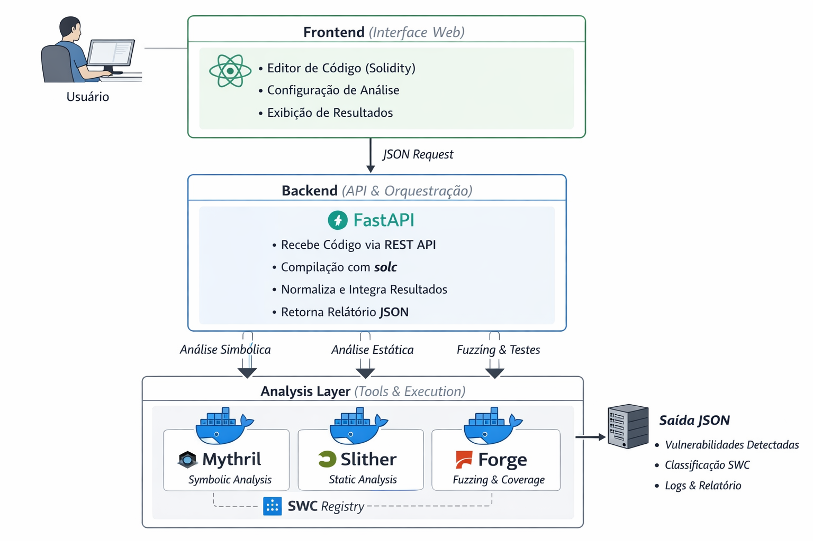

# 🧠 Solidity IA Analyzer

**Solidity IA Analyzer** é uma aplicação web desenvolvida em **React + Node.js**, que simula um ambiente de **análise estática e simbólica de contratos inteligentes Solidity**, integrada com **Inteligência Artificial (LLM)** para interpretação contextual e relatórios executivos em português.  

Inspirado em ferramentas como **Slither**, **Mythril** e **Foundry (Forge)**, o projeto oferece uma plataforma **educacional e interativa** para entender, visualizar e medir vulnerabilidades de contratos Ethereum.

---

## 🚀 Funcionalidades Principais

### 🤖 LLM Integrado (OpenAI + Ollama)
- Suporte híbrido inteligente:
  - **OpenAI GPT-4o-mini** (modo online, alta precisão)
  - **Ollama local** (modelos como `mistral`, `llama3`, `phi3` — modo offline)
- Gera descrições contextuais e impactos de negócio.
- Produz relatórios automáticos com linguagem executiva.

---

### 🧾 Relatório Executivo (em Português)
- Novo botão **“Gerar Relatório Executivo”**.
- Gera automaticamente um `.txt` com:
  - **Resumo Executivo**
  - **Análise de Impacto**
  - **Exemplos Reais**
  - **Recomendações**
  - **Conclusão e Priorização**
- Linguagem clara, voltada para **gestores e investidores**, não apenas desenvolvedores.

---

### 🧠 Mapeamento Taxonômico (SWC Registry)
- Cada vulnerabilidade detectada é vinculada ao identificador **SWC** (Smart Contract Weakness Classification).  
  Exemplo:
  - Reentrancy → `SWC-107`
  - Unchecked Call Return Value → `SWC-104`
  - Access Control → `SWC-105`
- Permite correlacionar falhas entre diferentes ferramentas de análise (Slither, Mythril, etc).

---

### 💾 Histórico Avançado
- Cada execução salva:
  - Nome do arquivo e timestamp
  - Vulnerabilidades detectadas
  - Notas do usuário
  - Métricas (precisão, recall, latência)
- Persistência em `localStorage` com exportação `.sarif`.

---

### 🧩 Analisadores Integrados

#### **Slither (Simulação Estática)**
- Detecção heurística de padrões:
  - `tx.origin`, `delegatecall`, `call.value`, `send`, `transfer`
  - `selfdestruct`
  - Falta de `onlyOwner`
  - Uso de `assembly`
  - Pragma < 0.8.x (sem checagem de overflow)
- Classificação de severidade: High, Medium, Low, Informational
- Geração de relatórios `.json` e `.txt`

#### **Mythril (Simulação Simbólica)**
- Simula análise simbólica de execução:
  - Integer Overflow
  - Unchecked Calls
  - Access Control Bugs

#### **Forge (Fuzzing Simulado)**
- Simula execução de testes automatizados e fuzzing.
- Relatórios de cobertura e falhas geradas.

---

## 🧰 Tecnologias Utilizadas

| Categoria | Tecnologia |
|------------|-------------|
| **Frontend** | React.js, TailwindCSS, Chart.js |
| **Backend** | Node.js, Express, dotenv, chalk, node-fetch |
| **IA (LLM)** | OpenAI GPT-4o-mini + Ollama Local (Mistral, Llama3, Phi3) |
| **Armazenamento** | localStorage |
| **Relatórios** | JSON e TXT (SARIF-like) |
| **Ferramentas de Build** | Create React App |

---

## ⚙️ Modo Híbrido Inteligente

| Cenário | Ação |
|----------|------|
| `OPENAI_API_KEY` configurada | Usa API OpenAI (alta precisão) |
| Sem `OPENAI_API_KEY` | Usa Ollama local automaticamente |
| Sem modelo Ollama instalado | Sugere comando `ollama pull mistral` no log |

💡 **Resultado:** nunca falha por falta de API ou internet.

---

## 🎨 Interface e Design

- Tema escuro (`#0f0f10`, `#09090a`)
- Paleta de severidade:
  - 🔴 **High:** #ef4444  
  - 🟠 **Medium:** #f59e0b  
  - 🟢 **Low:** #10b981  
  - ⚪ **Informational:** #94a3b8
- Layout fluido e moderno, focado em legibilidade e contraste.
- Dashboard interativo com gráficos de métricas.

---

## 💾 Instalação e Execução

### 🔧 Pré-requisitos
- Node.js ≥ 18.x  
- npm ou yarn  
- (Opcional) [Ollama](https://ollama.com/download) instalado para modo offline

---

### 📦 Passos

```bash
git clone https://github.com/jfjoaofilho/solidity-ia-analyzer.git
cd solidity-ia-analyzer
npm install
```

▶️ Backend (servidor LLM)

```bash
cd backend
npm install
npm run start
```

🌐 Frontend

```bash
npm start
```

Acesse http://localhost:3000 no navegador.

---

### 📊 Geração de Relatórios

Após rodar uma análise (ex: via módulo Slither):

1. Clique em “Run Analysis”

2. Visualize as vulnerabilidades detectadas

3. Clique em “Gerar Relatório Executivo”

Será baixado um .txt completo em português

Formato gerado:

```bash
📄 RELATÓRIO EXECUTIVO — Contrato MyToken.sol

1️⃣ RESUMO EXECUTIVO
Foram identificadas 5 vulnerabilidades de severidade variada...

2️⃣ IMPACTO DE NEGÓCIO
Falhas de reentrância e acesso indevido podem permitir retirada indevida de fundos...

3️⃣ RECOMENDAÇÕES
Implementar ReentrancyGuard, revisar modifiers e atualizar versão do compilador.
```

### 🧠 Ideia Central

A proposta é criar uma suíte de auditoria inteligente e educacional que:

- Detecta vulnerabilidades típicas.

- Gera insights executivos com IA.

- Mede desempenho técnico e de tempo.

- Simula a integração entre ferramentas de segurança blockchain.

### 🧮 Métricas de Risco (matriz clássica)

| Nível            | Descrição                                            | Exemplo                       |
| ---------------- | ---------------------------------------------------- | ----------------------------- |
| 🔴 Alta          | Perda total de fundos, controle indevido do contrato | Reentrancy, Access Control    |
| 🟠 Média         | Falhas parciais, perda de lógica                     | Manipulação de oráculo        |
| 🟡 Baixa         | Impacto mínimo                                       | Gas inefficiency              |
| 🔵 Informacional | Risco indireto, útil para análise                    | Variável pública não sensível |

### ⚙️ Classificação Simplificada

| Pontuação | Classificação |
| --------- | ------------- |
| 1–2       | 🔵 Informação |
| 3–4       | 🟡 Baixa      |
| 5–6       | 🟠 Média      |
| 7–9       | 🔴 Alta       |

### 📘 Licença

Licenciado sob MIT License — livre para uso, modificação e contribuição.

#### ✨ Autor

João Filho
💼 Residência em Criptografia e Blockchain
🔐 Foco em Segurança da Informação & Smart Contract Analysis
📧 joaofilho1467@gmail.com

### 📸 Arquitetura da Solução
